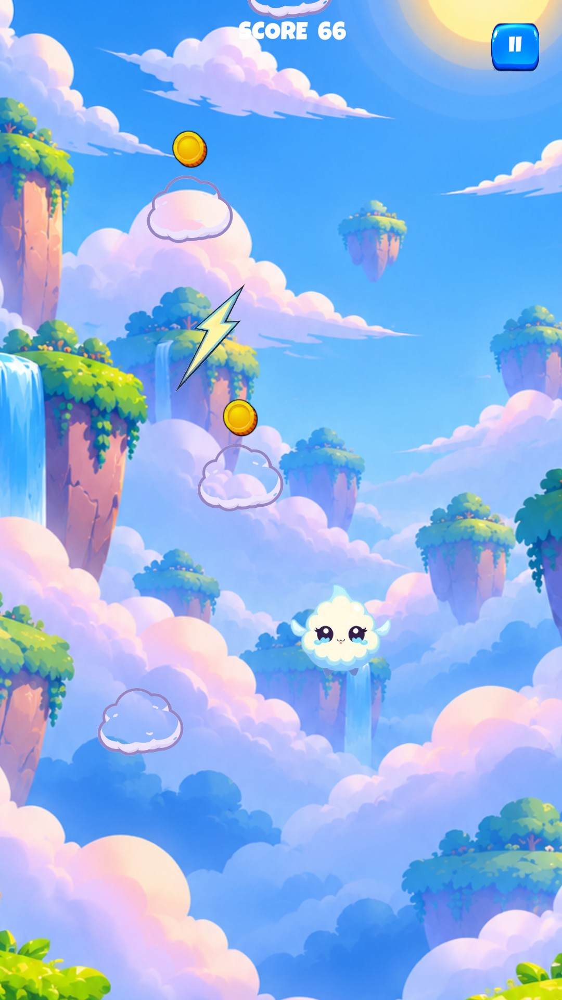
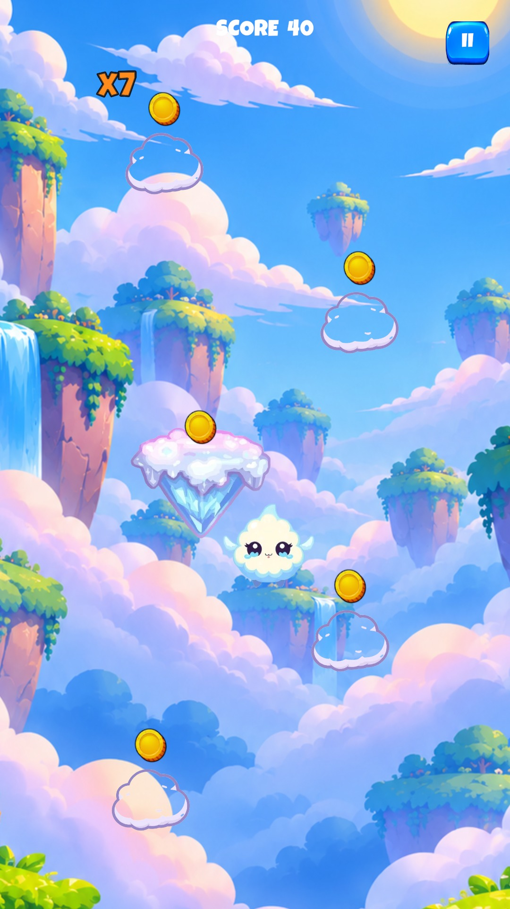
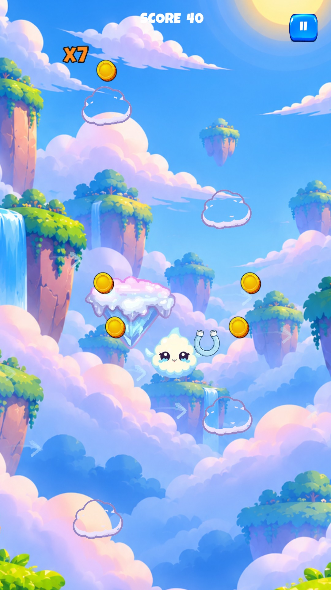
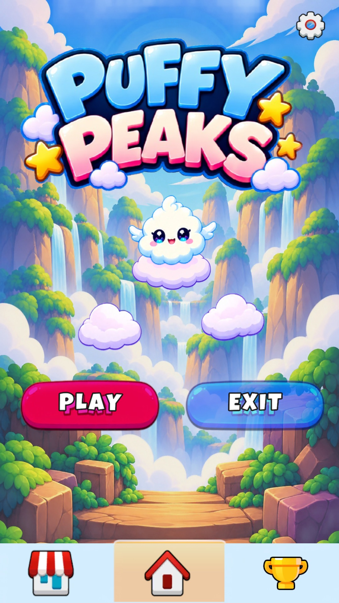
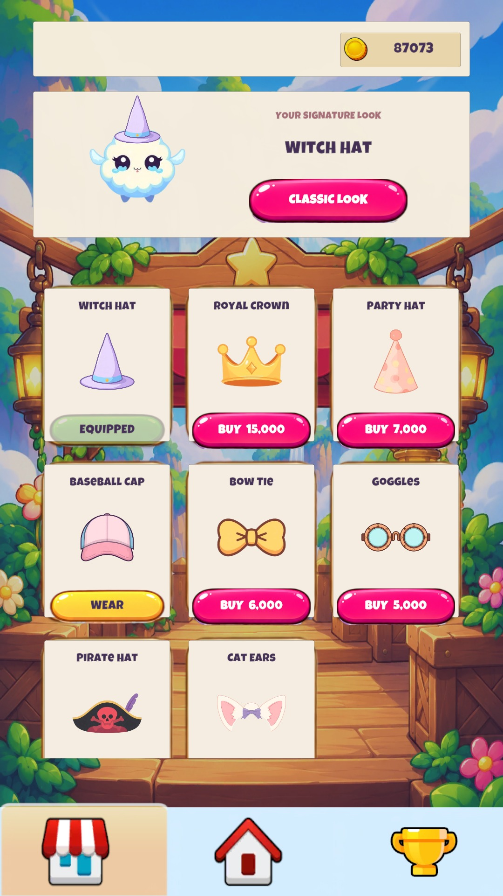

# Puffy Peaks

A cloud-themed 2D jumping game for Android, built with Unity and C#.

Jump between floating platforms, collect coins and keep climbing. Wind zones and moving platforms add variety as the difficulty increases. Unlock accessories in the Market and complete challenges to earn more coins.

## Gameplay

<table>
<tr>
<td></td>
<td></td>
</tr>
<tr><td>Cloud, boost and moving platforms</td><td>Landing combos</td></tr>
<tr>
<td></td>
<td></td>
</tr>
<tr><td>Wind zones</td><td>Magnet power-up</td></tr>
</table>

## Menus

<table>
<tr>
<td></td>
<td></td>
<td></td>
</tr>
<tr><td>Main Menu</td><td>Market</td><td>Game Over</td></tr>
</table>

## Features

- Vertical jumping, camera tracking and progressively harder platform layouts.
- Wind zones, moving platforms and precision landing combos.
- Collectible coins, magnet and shield power-ups, and eight cosmetic accessories with a character preview.
- Challenges with progress tracking, coin rewards and new goals after completion.
- Pause, restart, settings and local high-score storage.

## Built with

Unity and C#.

## Code

| System | Script |
| --- | --- |
| Run flow, scoring and difficulty | [GameManager.cs](Source/GameManager.cs) |
| Player movement | [OyuncuKontrol.cs](Source/OyuncuKontrol.cs) |
| Wind | [RuzgarBolgesi.cs](Source/RuzgarBolgesi.cs) |
| Landing combos | [KomboSistemi.cs](Source/KomboSistemi.cs) |
| Market | [MarketManager.cs](Source/MarketManager.cs) |
| Challenges | [ChallengesController.cs](Source/ChallengesController.cs) |
| Menus | [MenuManager.cs](Source/MenuManager.cs) |

Puffy Peaks is currently in closed testing on Android. Screenshots are captured in Unity Editor; feature previews use controlled capture scenarios to show each mechanic clearly.

This repository contains game scripts and screenshots. The complete Unity project and licensed art are maintained separately in a private backup. Service identifiers and signing credentials are not included here.