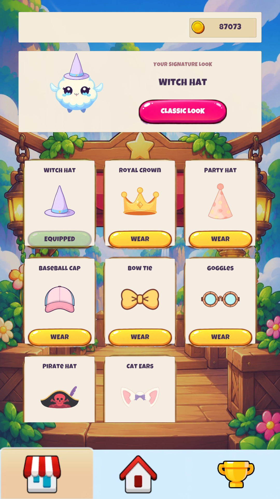

# Puffy Peaks

A cloud-themed 2D jumping game for Android, built with Unity and C#.

Jump between floating platforms, collect coins and keep climbing. Wind zones and moving platforms add variety as the difficulty increases. Unlock accessories in the Market and complete challenges to earn more coins.

## Gameplay

## Menus

<table>
<tr>
<td></td>
<td></td>
<td></td>
</tr>
<tr><td>Main Menu</td><td>Market</td><td>Game Over</td></tr>
</table>

## Features

- Vertical jumping, camera tracking and progressively harder platform layouts.
- Wind zones, moving platforms and precision landing combos.
- Collectible coins and eight cosmetic accessories with a character preview.
- Challenges with progress tracking, coin rewards and new goals after completion.
- Pause, restart, settings and local high-score storage.

## Built with

Unity 6000.3.19f1, C#, uGUI, TextMeshPro, Input System and Universal Render Pipeline.

## Code

| System | Script |
| --- | --- |
| Run flow, scoring and difficulty | [GameManager.cs](Source/GameManager.cs) |
| Player movement | [OyuncuKontrol.cs](Source/OyuncuKontrol.cs) |
| Wind | [RuzgarBolgesi.cs](Source/RuzgarBolgesi.cs) |
| Landing combos | [KomboSistemi.cs](Source/KomboSistemi.cs) |
| Market | [MarketManager.cs](Source/MarketManager.cs) |
| Challenges | [ChallengesController.cs](Source/ChallengesController.cs) |
| Menus | [MenuManager.cs](Source/MenuManager.cs) |

The game is in active development and Android testing. Screenshots are captured in Unity Editor; rewarded ads are still being validated on Android.

This repository contains game scripts and screenshots. The complete Unity project and licensed art are maintained separately in a private backup. Service identifiers and signing credentials are not included here.