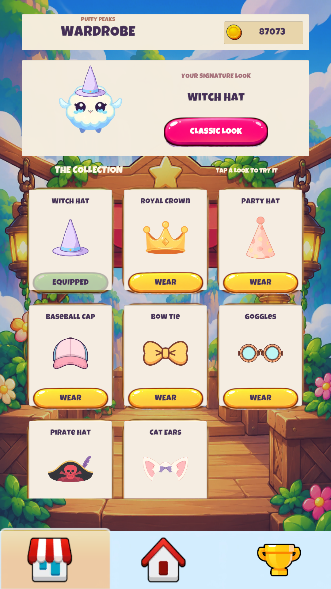
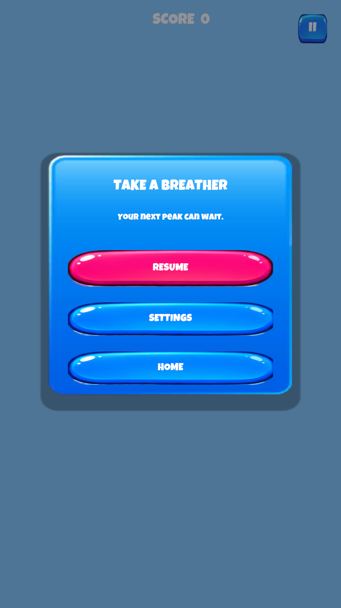

# Puffy Peaks

A work-in-progress portrait 2D jumping game built with Unity and C#, targeting Android.

This repository presents the game and its application scripts for internship review. It is a source showcase, not a complete runnable Unity project: scenes, licensed art, third-party SDKs and service configuration are intentionally omitted. The complete project is maintained separately as a private backup.

## Screens

<table><tr>
<td></td>
<td></td>
<td></td>
</tr><tr><td>Wardrobe</td><td>Pause</td><td>Game over</td></tr></table>

The images are Unity Editor previews. They demonstrate the interface, rather than verified mobile gameplay. Older pause and game-over previews may differ from the latest development build.

## Implemented systems

- Vertical jumping with faster jump pacing, falling and camera tracking.
- Gradual difficulty progression with a limited share of moving platforms.
- Height-based wind bands and precision landing combos.
- Earned currency, eight cosmetic items, ownership and equipment persistence.
- Renewable challenges with progress tracking and currency rewards.
- Pause, restart, settings, main menu and game-over flows.
- Local score storage and Google Play Games integration code.

## Code guide

| Area | Files |
| --- | --- |
| Run flow, scoring and difficulty | [GameManager.cs](Source/GameManager.cs) |
| Player movement and jumping | [OyuncuKontrol.cs](Source/OyuncuKontrol.cs) |
| Wind and landing combos | [RuzgarBolgesi.cs](Source/RuzgarBolgesi.cs), [KomboSistemi.cs](Source/KomboSistemi.cs) |
| Cosmetic shop and preview | [MarketManager.cs](Source/MarketManager.cs) |
| Renewable challenges | [ChallengesController.cs](Source/ChallengesController.cs) |
| Menus and animation | [MenuManager.cs](Source/MenuManager.cs), [MenuCanlandirici.cs](Source/MenuCanlandirici.cs) |
| Camera | [KameraTakip.cs](Source/KameraTakip.cs) |

## Development environment

- Unity 6000.3.19f1
- C#, uGUI and TextMeshPro
- Unity Input System and Universal Render Pipeline
- LevelPlay and Google Play Games SDK integrations

## Current status

The game is in development and mobile testing. Rewarded advertising on Android still requires configuration and validation. Integration scripts are included for review; app-specific identifiers are omitted. `GPGSIds` is generated by Google Play Games setup and is not included here.

The project uses third-party visual assets and AI-assisted implementation and UI iteration. Raw asset packs are not redistributed in this repository. This repository does not grant a license to reuse third-party visuals.
